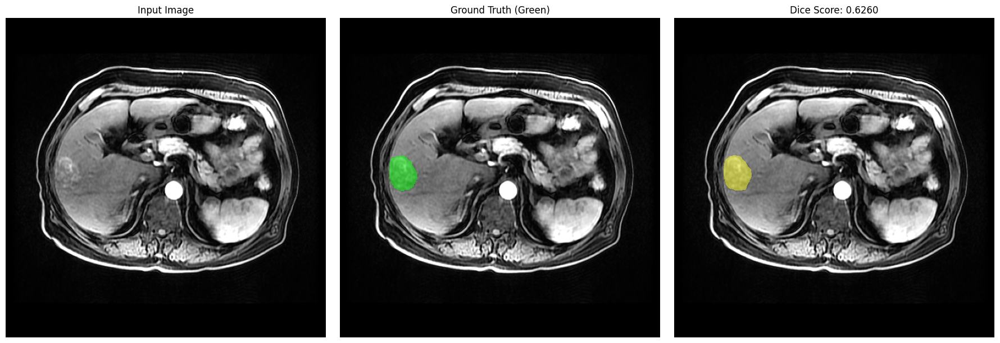
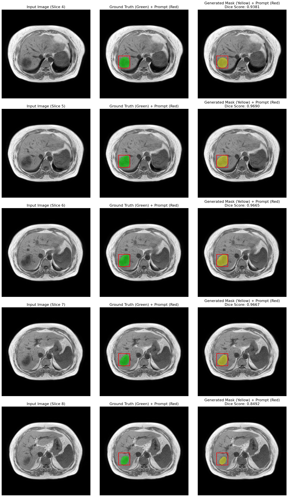

# MedSAM2 3D Segmentation - Bidirectional Propagation (LLD-MMRI Dataset)

This repository demonstrates the use of the MedSAM2 3D segmentation pipeline on the **LLD-MMRI (Liver Lesion Detection Multi-phase MRI)** dataset. 

## Overview & Dataset
The primary notebook (`LLD_MMRI_MedSAM2.ipynb`) performs lesion segmentation on the LLD-MMRI dataset. It reads multi-phase MRI images, extracts bounding box prompts from the dataset's JSON annotations (using the slice with the largest lesion area as the "key slice"), and passes that bounding box to MedSAM2 to track and segment the lesion across the entire 3D volume.

By default, placing a prompt (bounding box) on a key slice in a 3D medical scan using MedSAM2's `propagate_in_video` function only propagates **forward** to the end of the scan. This results in missing segmentations for any slices *preceding* the key slice.

We modified the core inference loop within the notebook to run the `propagate_in_video` function **bidirectionally**:

```python
# 1. Forward Propagation
for f_idx, _, l in predictor.propagate_in_video(state):
    segs[f_idx] = (l[0] > 0.0).cpu().numpy()
                    
# 2. Backward Propagation (Added)
for f_idx, _, l in predictor.propagate_in_video(state, reverse=True):
    segs[f_idx] = (l[0] > 0.0).cpu().numpy()
```

## Included Files
- `LLD_MMRI_MedSAM2.ipynb`: The primary notebook, updated with the bidirectional propagation fix.
- `MR-391135_1_C+A_0000.nii`: The original input MRI scan (Dimensions: 72 slices × 512 × 512).
- `MR-391135_1_C+A_0000_k36_mask.nii`: The resulting generated 3D mask/label image (Dimensions: 72 slices × 512 × 512).
- `MR-391135_1_C+A_0000_comparison.png`: A visualization comparing the raw image, ground truth, and the MedSAM2 generated mask, including the Dice score.
- `MR62668_2_InPhase_0000_5_slice_comparison.png`: A multi-slice vertical grid visualization showing the propagation across 5 sequential slices (key slice ± 2).

## Visualization

Below is the visualization for **Slice 36** (the key slice), comparing the raw input MRI, the ground truth segmentation with the provided bounding box prompt, and the generated mask from MedSAM2:



### 5-Slice Bidirectional Propagation Visualization
Below is a demonstration of the model successfully propagating the prompt across multiple adjacent slices (from Key Slice - 2 down to Key Slice + 2). This stacked grid provides a comprehensive view of how well the 3D segmentation generalizes beyond the initial prompted slice. The Red Box is denoting the prompt (Bounding box).



## Results
With backward propagation enabled, the segmentation successfully spans the entire lesion in 3D (slices 0 to 71), improving the overall Dice score significantly compared to unidirectional propagation.

## LICENSE

This project is distributed under the MIT License. See `LICENSE` for more information.

## Contact
Email : manolinadas2004@gmail.com
